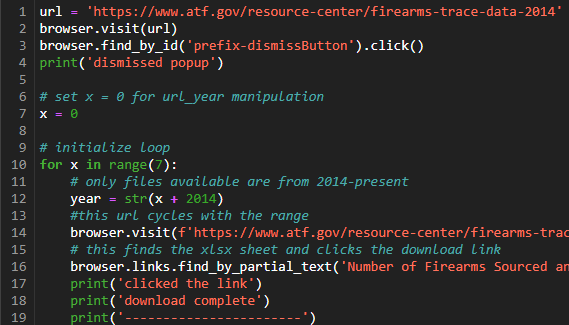
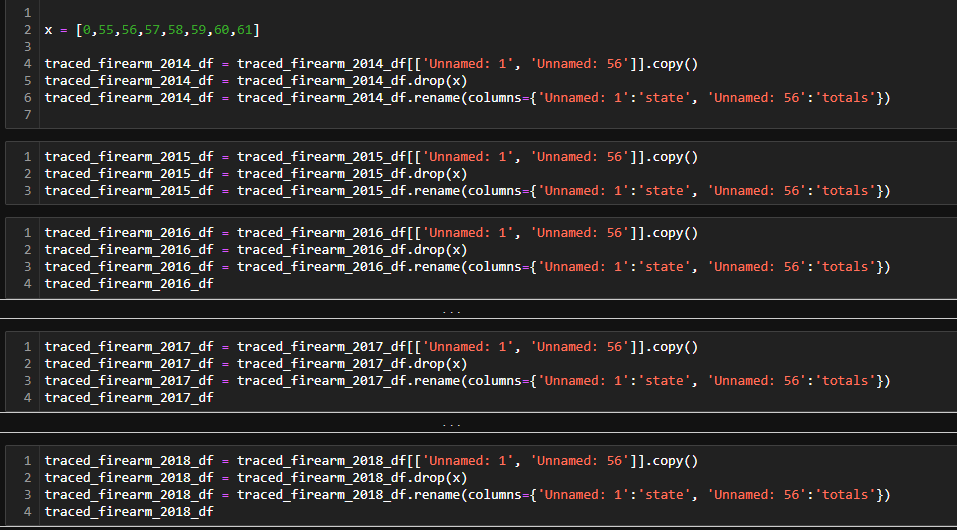
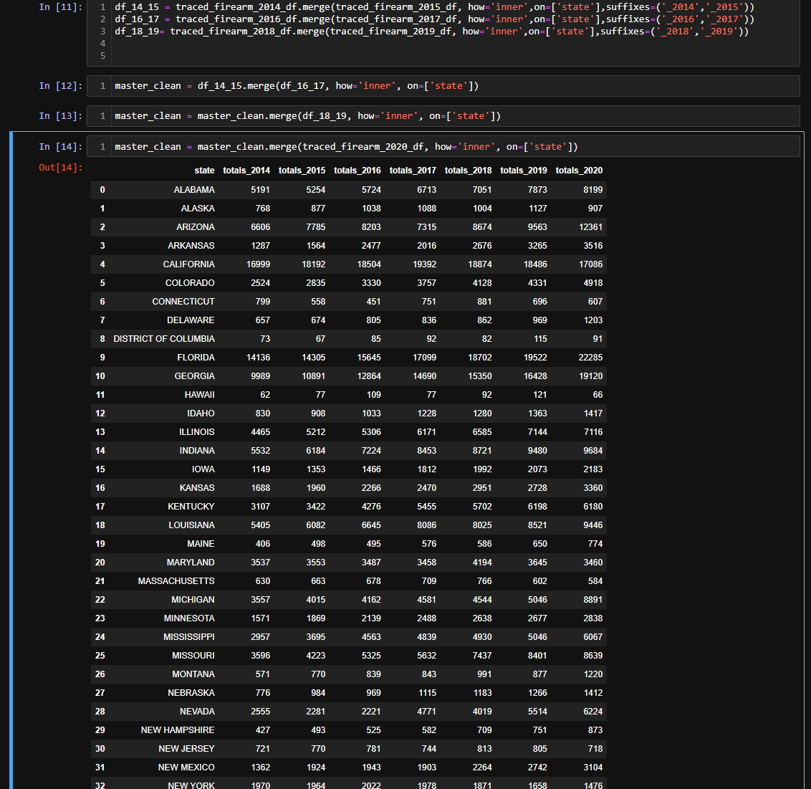

# README
# Project_02_ETL
Team members: Celena Blackwood, Alec Henderson, Kris Shaw and Amy Philippon

# Introduction
According to Time Magazine there are 325 million people in America and more than 
265 million guns.  31% of households in the US have firearms and 22% of American 
adults personally own one or more firearms per UC Davis Health. In this ETL project 
multiple sources were combined in a SQL database to supply opportunity to perform analysis on gun 
deaths in America. The database contains tables of gun deaths and rates, gun licenses and 
registrations, registered weapons, and gun laws throughout the United States. 

# Extract
The datasets used are csv files from multiple sources.

**Original data sources:** 

1. https://en.wikipedia.org/wiki/Gun_laws_in_the_United_States_by_state

2. https://www.cdc.gov/nchs/pressroom/sosmap/firearm_mortality/firearm.htm
3. https://www.kff.org/other/state-indicator/firearms-death-rate-per-100000/?activeTab=graph&currentTimeframe=0&startTimeframe=20&sortModel=%7B%22colId%22:%22Location%22,%22sort%22:%22asc%22%7D
4. https://www.kff.org/other/state-indicator/firearms-death-rate-per-100000/?currentTimeframe=0&selectedDistributions=firearms-death-rate-per-100000&sortModel=%7B%22colId%22:%22Location%22,%22sort%22:%22asc%22%7D
5. https://www.statefirearmlaws.org/sites/default/files/2020-07/DATABASE_0.xlsx
6. https://www.atf.gov/resource-center/data-statistics
7. https://data.world/nkrishnaswami/gun-deaths-by-county

# Transform

The "Registered Weapons by State" data was pulled from the 2011 through 2021 Report on Firearms Commerce in the US, located on the Bureau of Alcohol, Tobacco, Firearms and Explosives website. For each year and state destructive devices which include bombs, grenades, and rockets were removed along with silencers from the total registered weapons final data set.  Weapons that remain are machineguns, short barreled rifles and shotguns, pistols, and revolvers.  That weapons data was placed in an excel file then converted to csv. The total weapon columns were configured into ascending order by year. 

To compare how gun laws impact gun deaths on a per state basis we pulled a data set, "Gun Deaths by State by Year" from 
Data.world that contains the total number of gun deaths in the US by county from 1999 – 2019. 
We imported this CSV file and saved it to a dataframe. We used the GROUPBY function to group 
the counties by the state that they are located in as well as by year. Then we used the SUM 
function to total the numbers of death by gun violence in each state by year ranging from 1999 –
2019. This narrowed down the rows from 14,380 to 1,054. Next we replaced the state 
abbreviations with the state name by creating a variable (States) that contained a dictionary. 
The key is the 2 digit state abbreviation and the value is the full state name. We then used the 
replace function to update the state names. After cleaning the data, we saved the dataframe to a
CSV using the to_csv function.

 

The "summary_law_count_change" file started out as <national_gun_laws_per_year.xlsx>. It was read into an IPYNB via 
pandas then trimmed of redundant columns. The count of laws totals were grouped and assigned to a list by state, then the first and last entries were
assigned to data frames representing the start and end before being joined to make one data frame.
The final data frame displayed values of the number of laws present at the beginning and end of the ten year time cycle. 

To obtain a dataset of confiscated weapons, "master_traced_firearms", a bot was made to find and click download links on the ATF website.  The seven files were read into a IPYNB.  Extraneous columns were cut and remaining columns were renamed.  
All columns were merged into one cohesive DataFrame.  

Database normalization was required for several csv files. The files required transformations to break the "year" into its own column allowing the "state" name 
to be the assigned primary key.

Data limitations for the project included: paywalls; 
some data inconsistences or lacking over a peroid of time; and
weapon data that was too generic making us unable to determine if the weapons were all firearms for some datasets.

# Load
All csv files were imported to PostgreSql and 7 tables were made.

ERD:

Schema:

After loading the data, we can run a detailed analysis to see if we can draw a correlation 
between how many gun laws a state has versus how many gun deaths that state had for a given 
year ranging from 1999 - 2019. Do more gun laws in a state decrease the number of gun deaths 
in that particular state? When a state adds laws, does that decrease the number of deaths from 
year to year. This data should also directly correspond with the firearm mortality rate that we 
pulled as it is calculated by dividing the total number of deaths per 100k people in the state 
during that given year. 
We also loaded a data set that contained the total number of registered firearms and issued 
firearm licenses per state. With this data set we can see if we can find any correlation between 
the gun deaths and the states that have the most issued gun licenses and/or registered firearms.

